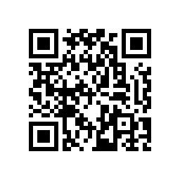

 **openGauss User Group** 
 &nbsp;&nbsp;&nbsp;openGauss User Group (oGUG for short) is an open local communication community for openGauss users to communicate around technical characteristics, practical application and operational progress.

 **Introduction oGUG role** 
   &nbsp;&nbsp;&nbsp;OGUG consists of three roles: Organizer, Member and Ambassador:
* Organizer:oGUG regional leader, responsible for coordinating the development and activity planning of oGUG in this region;
* Member: cooperate with the daily operation of regional oGUG, produce technical content as a user, participate in activities and promote openGauss.
* Ambassador: Help others understand or use openGauss,optimize product experience on behalf of users, and enhance other users understanding of openGauss.

 **Welcome to oGUG** 
 &nbsp;Links:https://www.wjx.cn/vj/YHy5Kck.aspx#
